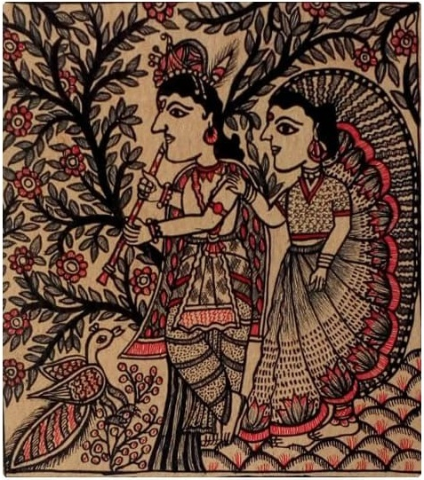

> Tikuli art  has a deep historical significance associated with it. ‘Tikuli’ is the term that is 
locally used for bindis, which are essentially colorful dots that women wear as accessories between 
their eyebrows. The bindi has been a symbol for the intellectual capacity of the feminine for time
immemorial. Tikuli art originates from Patna over 800 years back. The creation of tikuli art is a 
tedious process that requires a great deal of patience. Artists employ hardboards as their surface 
to draw on, and cut it into ornate shapes.

> 
